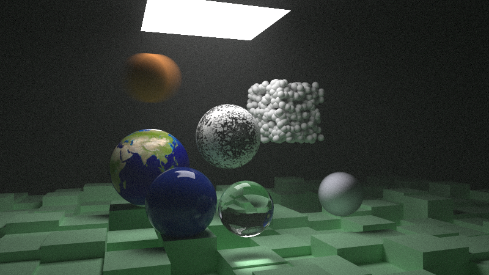

# Monte Carlo Path Tracer
CPU path tracer for producing unbiased photorealistic renders of virtual scenes. Includes support for various primitives, various material BRDFs, textures, volumes (i.e. 'fog'), Perlin noise, motion blur, depth of field, etc. 

Uses Bounding Volume Hierarchies (BVHs) to perform ray-intersection tests in O(logN) as opposed to O(N) with respect to object count. Additionally uses OpenMP to render multiple pixels in parallel by using multiple of the available hardware threads.



## Usage
Clone the project:
```bash
git clone github.com/oliver32768/monte-carlo-path-tracer.git
cd monte-carlo-path-tracer
```

Generate CMake files from CMakeLists.txt:
```bash
cmake -S . -B build
```

Build project:
```bash
cmake --build build
```

Run path tracer:
```bash
.\RayTracingInOneWeekend.exe [scene] [samples]
```

* Scene : Integer in the range 1 to 9 inclusive ; specifies the scene (out of the available 9) to render
* Samples : Integer in the range 1 to INT_MAX ; specifies the number of samples to average over at each pixel rendered
* Renders are saved to ./image.ppm once finished

## Credit
[Ray Tracing in One Weekend](https://raytracing.github.io/books/RayTracingInOneWeekend.html), Peter Shirley, Trevor David Black, Steve Hollasch (2024)

[Ray Tracing: The Next Week](https://raytracing.github.io/books/RayTracingTheNextWeek.html), Peter Shirley, Trevor David Black, Steve Hollasch (2024)
